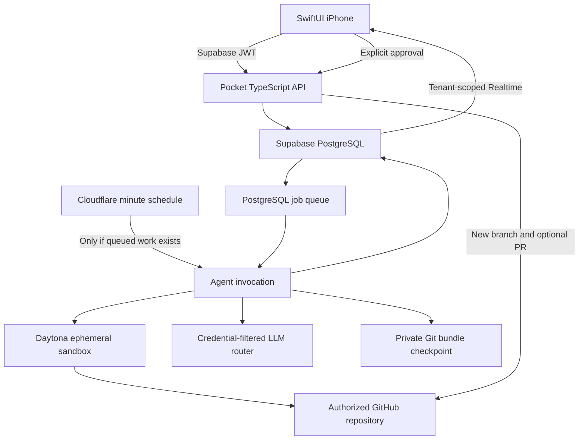

# Pocket architecture

The iPhone delegates and reviews. All repository execution happens remotely. A sleeping phone or an offline developer laptop never owns the job.

## Compute follows work

Users have no permanent VM, container, or sandbox. A claim starts a sandbox; completion/failure/cancellation deletes it. Idle users have only database rows and bounded checkpoint storage. The API runs on Cloudflare Workers. A minute schedule inspects the shared queue and starts one claim per invocation when work exists. Empty queues create neither a SQL socket nor compute. Hyperdrive caps origin connections at five and verifies the Supabase certificate. User count does not allocate environments.

The cloud HTTP transport avoids runtime JavaScript compilation. Local Fastify and cloud routing share all application handlers and authorization rules. Provider-neutral interfaces surround models, sandboxes, GitHub and job claims. No separate fleet or persistent polling process is needed in production.

## Queue and state

`Store` implements `JobQueue`. Claims use `FOR UPDATE SKIP LOCKED`, a random lease token, a 90-second lease, and five-second heartbeats. Phase changes are fenced by the lease token; cancelled jobs cannot become completed. A user-row lock serializes admission and enforces two active jobs. A project-row lock serializes Save numbering. Completion persists report, Save, branch continuation reference, and memory in one transaction.

Expired running jobs fail closed. They are not automatically replayed because repository tools and provider requests may have side effects. External shipping is separately idempotent; an ambiguous action requires inspecting its named branch before retrying. The queue can be replaced through the worker’s queue parameter.

## Hard limits

| Resource               | Initial limit                                    |
| ---------------------- | ------------------------------------------------ |
| Agent actions          | 6 cloud free / 24 local                          |
| Overall agent runtime  | 3 minutes cloud free / 10 local                  |
| Terminal command       | 120 seconds                                      |
| Terminal output        | 16,000 bytes; process group killed when exceeded |
| Task model tokens      | 18,000 cloud free / 60,000 local                 |
| Model output per call  | 2,400 tokens                                     |
| Invalid action retries | 1                                                |
| Active jobs per user   | 2                                                |
| Daytona idle auto-stop | 2 minutes                                        |
| Daytona TTL backup     | 20 minutes                                       |
| Changed files          | 200                                              |
| Changed file bytes     | 1 MB                                             |
| Git bundle             | 20 MB                                            |

The task timer begins before provider setup. On cancellation or expiry, sandbox deletion starts immediately. Provider cleanup failures are logged; Daytona TTL and immediate deletion on auto-stop are the last fallback. Live-provider behavior still needs verification.

The runner truncates and stops commands with excessive output. Child processes live only inside the sandbox. SDK calls have their own timeouts; deleting compute also terminates in-flight commands. The TTL bounds resources even after process crashes. A hard byte limit for model input is conservatively reserved from UTF-8 size plus framing; actual provider usage is recorded. Providers must honor their output limits. Unknown/malformed responses fail the task.

## Model cost

There is no default paid model. `MODEL_CATALOG` provides provider, actual model identifier, display name, and input/output prices in **US cents per million tokens**. Catalog entries without a configured key are disabled. Auto chooses the first configured model; Fast selects the lowest configured input rate; Powerful chooses the last configured model. These labels are deterministic configuration policies, not a model-quality classifier.

Each call reserves an input/output upper bound against the smaller of the task budget and catalog cap before sending. Actual usage is written after every response, so usage from failed tasks is retained. HTTP failures with no usage payload can have unknown provider charges; use provider-side spending caps as well. The UI’s dollar budget covers model usage; sandbox, storage, and hosting costs are separate.

The agent searches relevant files, starts from a partial path list, reads bounded files, sends compact project memory, and keeps only four recent tool exchanges plus original intent. It never automatically sends the full repository. Repository metadata persists in PostgreSQL and is refreshed by explicit connection sync; no dedicated caching service is needed.

## Saves and continuity

A Save is a Git commit captured in an incremental Git bundle with its immutable file-change manifest. Private Supabase Storage is used because unsent work cannot live in the user’s GitHub repository without violating “do not push.” Nothing is sent to GitHub until approval.

The branch’s latest Save becomes the next task’s starting point. Restore changes that continuation reference, never the remote branch. The sandbox clones the authorized branch, imports the bundle, and checks out the checkpoint. Memory keeps the last five bounded summaries separately from compute. Persistent full conversation compaction remains future work.

Shipping loads the persisted manifest and creates GitHub blobs/tree/commit through the API; it never runs repository code with a write token. It checks the base SHA before creating a new branch and optionally a PR. A moved base requires a new task; no force push is available. Tests are marked skipped if edits or arbitrary commands occur after them.

## Trust boundaries

Supabase validates user JWTs. Every API lookup checks project membership, and jobs also check ownership. Supabase clients have only tenant-scoped SELECT access to job updates, with no table-write permissions. Private checkpoint storage has no client policy. Backend DB credentials and storage service role remain server-side.

A separate GitHub App OAuth authorization uses a single-use hashed state, verifies the GitHub identity against the signed-in Supabase user, and encrypts its short-lived user token server-side. Installation linking verifies that token against the signed-in Supabase GitHub identity and uses the intersection of the user’s accessible repositories and their App installation. Clone tokens are repository-scoped and read-only. Write tokens exist only during approved shipping on the trusted API. Signed, idempotent webhooks revoke memberships and cancel jobs on installation suspension/deletion or repository removal.

Sandbox code is untrusted. File tools reject traversal and escaping symlinks; Python helpers use isolated interpreter mode. No LLM API keys, App private keys, Supabase keys, or Git write credentials enter the agent sandbox. Repository output is treated as data in the model prompt. Shell tools remain powerful within the disposable sandbox; prompt-injection resistance is not a guarantee of model obedience.

## Known production work

APNs, richer previews, robust action reconciliation, automatic refresh for expired GitHub App user tokens, proactive metadata refresh, retention/garbage collection, daily/account-wide cost limits, and more extensive provider integration tests need follow-up. The current suite uses controlled adapters for real-runtime behavior and requires no billed services.
